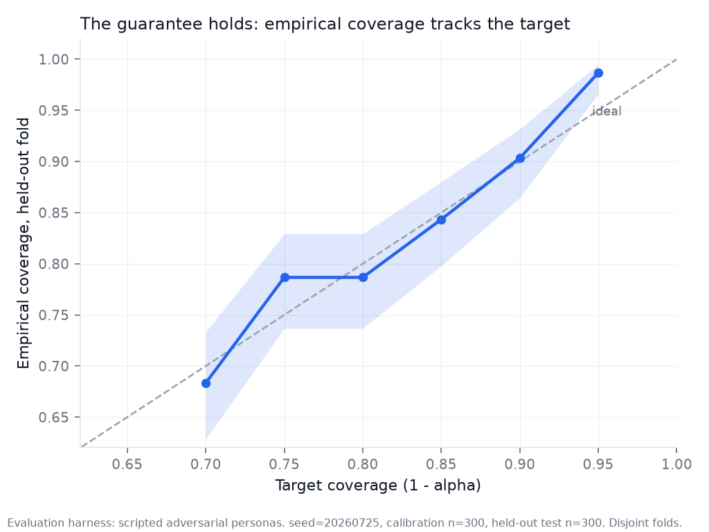
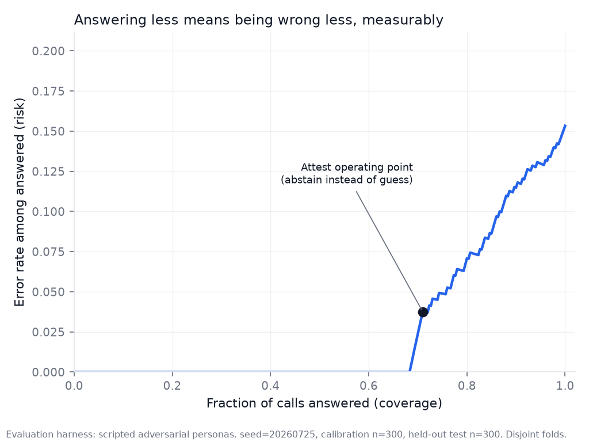
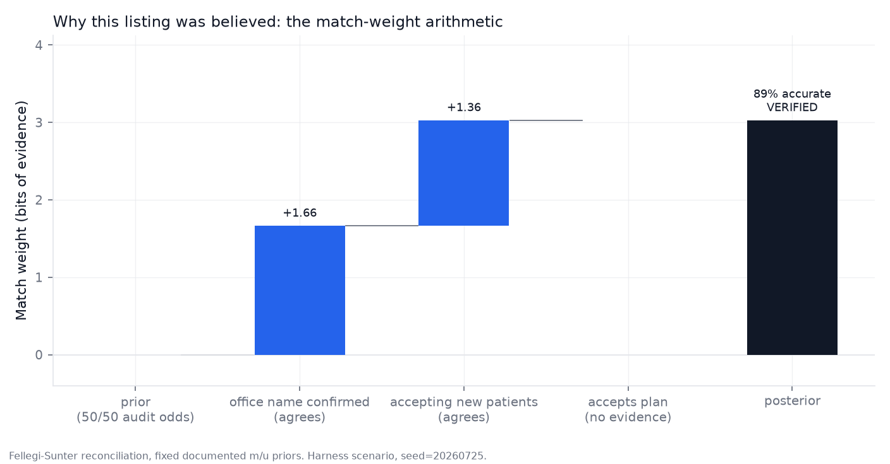
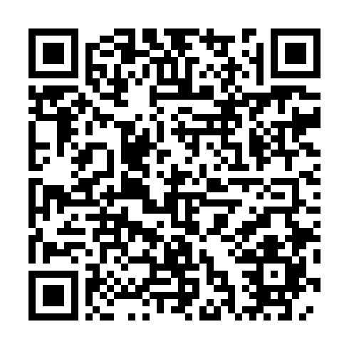
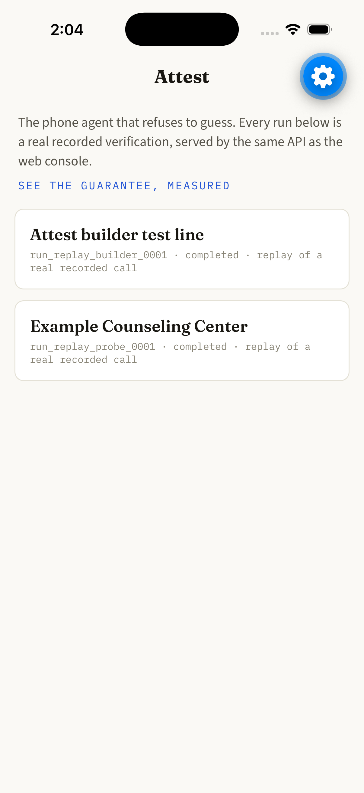
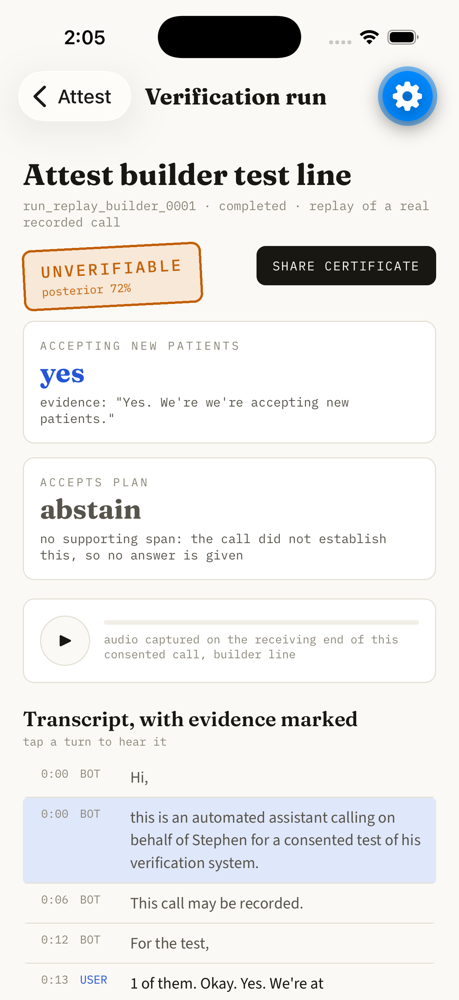
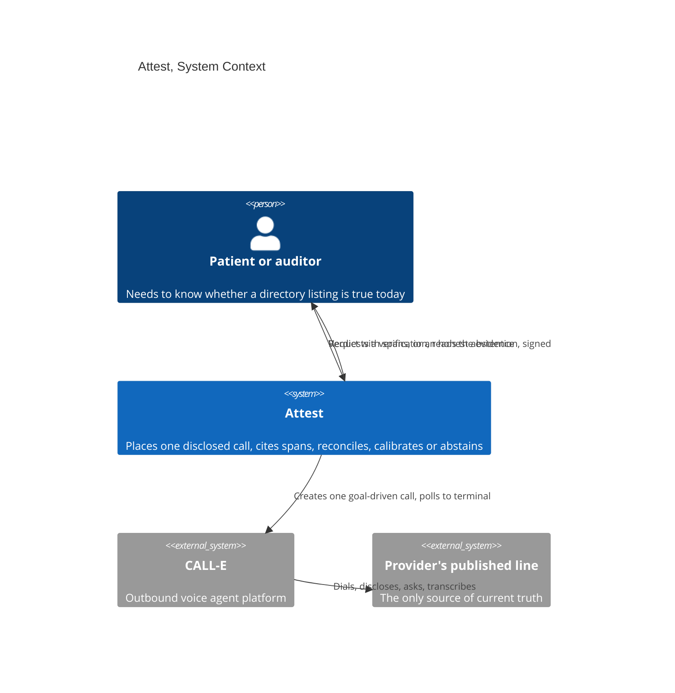

# ATTEST

[](https://github.com/StephenSook/attest/actions/workflows/ci.yml)
[](./LICENSE)
[](https://attest-web-phi.vercel.app)
[](https://github.com/StephenSook/attest/releases/latest)
[](./pyproject.toml)
[](./frontend)
[](./mobile)
[](https://github.com/CALLE-AI/call-e-integrations)

**The phone agent that refuses to guess.**

## Live demo

| Surface | Where |
|---|---|
| Web console | <https://attest-web-phi.vercel.app> |
| Verify a certificate | <https://attest-web-phi.vercel.app/verify> (paste any attestation; verifies in your browser) |
| The measured guarantee | <https://attest-web-phi.vercel.app/calibration> |
| API | <https://attest-api-o5gm.onrender.com/healthz> (free tier; first hit may take a moment to warm) |
| Attestation public key | <https://attest-api-o5gm.onrender.com/api/attestation-key> (also committed at [`docs/attestation-public-key.pem`](docs/attestation-public-key.pem), which verifies certificates from the deployed API. The local `docker compose` path signs with a separate, deliberately public demo key served at its own `/api/attestation-key`, so verify local certificates against that one.) |
| Android app (APK) | <https://github.com/StephenSook/attest/releases/latest> |
| iOS app (TestFlight) | build approved by Apple; public link being enabled, and it lands here when it is |
| Zero-credential local run | `docker compose up --build` |

## Why this matters

Half of health-insurance provider directory listings are wrong: a federal audit found roughly 50 percent inaccurate, a congressional secret-shopper study reached a bookable appointment 18 percent of the time, and re-audited listings were still wrong 44.8 percent of the time months later. The record exists. The record lies. The only instrument that establishes current truth is a phone call to the published line.

Attest places **one disclosed outbound call** through [CALL-E](https://github.com/CALLE-AI/call-e-integrations), extracts a structured answer where **every field cites the verbatim transcript span** that supports it, reconciles the answer against the directory record with **transparent Fellegi-Sunter match weights**, and returns either a **calibrated confidence or an explicit abstention** backed by a distribution-free coverage guarantee computed on held-out data.

## The numbers, regenerated by one command

Every figure and number below comes from `uv run python -m eval`: fixed seed 20260725, six scripted adversarial respondent personas, 300 calibration and 300 held-out test scenarios, disjoint folds. Nothing judge-facing is scripted data presented as real; the console shows real recorded calls, and the harness is labeled as a harness everywhere it appears.

| At a 90% coverage target | |
| --- | --- |
| Empirical coverage on the held-out fold | **90.3%** (Wilson 95%: 86.5 to 93.2) |
| Abstention rate | **57.7%** |
| Accuracy when answering | **96.9%** |
| Error if forced to answer everything | 12.3% |







Real-channel transfer: 36 pre-registered scripted calls to a consented line (28 attributable after a documented deviation protocol) scored with the harness-calibrated threshold gave 28 of 28 coverage (Wilson lower bound 87.9 percent; worst-case floor counting every excluded call as a miss, 77.8 percent), 42.9 percent abstention, and no wrong answers. A transfer test of extraction plus calibration across the real telephone channel. Measured against the same gate, the real channel abstained less than the seeded harness (42.9 against 57.7 percent) and still produced no wrong answers. Class-conditional check: the marginal average hid an under-covered class ("no" at 83.2 percent against the 90 percent target); Mondrian per-class thresholds close most of that gap (88.5 percent) and the finding ships in the metrics rather than being averaged away. Coverage holds from calibration folds as small as 50. Ablations (same folds): remove hedge detection and accuracy-when-answering drops to 87.8 percent; remove the dead-end guard and wrong-number chatter gets parsed as answers: accuracy when answering drops to 89.8 percent while abstention balloons to 54.3 percent; remove conformal calibration and the coverage guarantee disappears entirely. The full table is in `eval/results/ablation.md`.

## Where the load-bearing CALL-E call lives

One module, on purpose: [`backend/app/calle/client.py`](backend/app/calle/client.py) wraps the official `calle-ai` SDK for every REST call, and [`backend/app/calle/webhook.py`](backend/app/calle/webhook.py) verifies webhook signatures over raw bytes with the five-minute replay window the SDK omits. Empirical note: the live API currently accepts `webhook_url` but does not deliver webhooks (verified with a tunnel capture on a completed call), so the resumable poller in [`backend/app/calle/poller.py`](backend/app/calle/poller.py) is the authoritative terminal path and the receiver fails closed.

## Run it yourself, zero credentials

```bash
docker compose up --build
# console at http://localhost:5173, API at http://localhost:8000
# seeded with a scrubbed real recorded call; live dialing stays off in mock mode
```

Or natively:

```bash
uv sync && uv run pytest          # 217 tests, no network, no real calls ever
uv run python -m eval             # regenerates every number and figure above
uv run python scripts/seed_replay.py
uv run uvicorn app.main:app       # backend on :8000
cd frontend && pnpm install && pnpm dev   # console on :5173
```

## What one run looks like

1. A run is created with the directory record it verifies; the run id doubles as the CALL-E `Idempotency-Key`, so a retry can never double-dial.
2. The call opens by stating the AI identity and verification purpose together, announces recording, releases anyone who objects, and never guesses.
3. The transcript comes back as per-turn text with second offsets and speaker labels. Extraction finds the answer with a cue lexicon, dampens hedges ("I think so") by graded strength, treats dead-end turns (wrong number, refusal) as non-responsive, and pins the exact character span.
4. Reconciliation adds log2(m/u) bits of evidence per agreeing field on a stated 50/50 audit prior, and the verdict decomposes into a waterfall anyone can audit.
5. Split conformal calibration decides whether the trust score clears the answering bar; when the prediction set is not a single value, Attest abstains, and the guarantee says how often the truth stays inside the set.

## Attest Pocket: the receipt in your pocket

The patient-side companion app (Expo, iOS and Android, `mobile/`): browse the
runs ledger, open a run to see the verdict stamp, evidence spans, transcript,
and the receiving-end call audio (tap a turn to hear it), share the signed
attestation certificate as a PDF, and check the measured guarantee including
the real-telephone transfer panel. Read-only against the same production API
as the web console; nothing is baked into the app.

| Platform | Install |
| --- | --- |
| Android | [Direct APK](https://github.com/StephenSook/attest/releases/download/pocket-v0.1.0/attest-pocket.apk) from the release, or scan: |
| iOS | TestFlight build 1.0.0 (3) passed Apple's Beta App Review on 2026-07-27. The public install link is a separate switch on the tester group; it lands here, with a QR code, as soon as it is on. |



<p>
  
  
</p>

## Security posture

Server-authoritative state (the browser never submits verdicts), phone numbers redacted in every API response by test-enforced policy, SSRF resolve-then-pin validation with the full metadata blocklist for any future server-side fetch, raw-byte HMAC webhook verification with replay windows, fail-closed 503s when secrets are unconfigured, keyed run creation with constant-time comparison, gitleaks in CI over full history, and no secret ever reaching the client.

## Architecture



## Repository map

```
backend/app/        FastAPI backend; calle/ is the integration seam
  extract.py        span-grounded extraction with hedge dampening
  hedge.py          graded epistemic cue lexicon
  reconcile.py      Fellegi-Sunter reconciliation, documented priors
  security/ssrf.py  resolve-then-pin URL validation
eval/               seeded harness: personas, conformal core, figures, ablations
mock_calle/         standalone CALL-E mock replaying a scrubbed real payload
skills/verify-by-phone/   the self-contained Agent Skill (upstream contribution)
frontend/           the console and the landing experience
```

## Honest status

Working end to end today: real calls through the seam, the full extraction, reconciliation, and calibration pipeline, the seeded evaluation, the live console and landing. Known limitations: platform webhooks do not deliver yet (poller is authoritative), the free-tier database is ephemeral (reseeded on boot), and disclosed verification cannot measure how disclosure itself changes answers, because no undisclosed baseline exists inside this protocol.

## License

MIT
